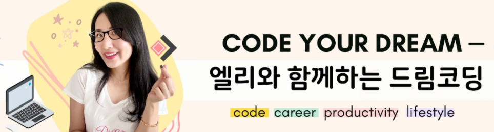
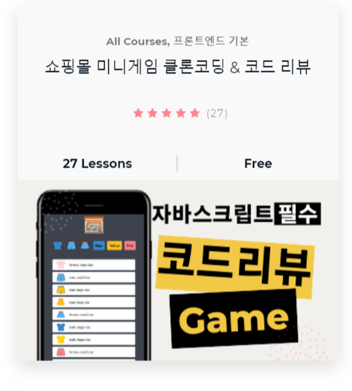

# Shopping Mall Game

## Purpose

2개의 강의를 듣고, 직접 clong coding 하면서 _**Frontend Developer**_ 로 한 걸음 다가가자.

## How to study

### Basic

1. [_**엘리와 함께하는 드림코딩**_](https://www.youtube.com/playlist?list=PLv2d7VI9OotQ1F92Jp9Ce7ovHEsuRQB3Y)에서 HTML, CSS 부분 강의들으면서 정리

### Apply

2. [쇼핑몰 미니게임 클론 코딩 & 코드 리뷰](https://academy.dream-coding.com/courses/mini-shopping) 에서 쇼핑몰 게임 clone coding을 하면서 html,css,javascript 학습한다.

3. 아직 완성하지 못한 ClassPage 완성.

## Plan

[엘리와 함께하는 드림코딩](https://www.youtube.com/playlist?list=PLv2d7VI9OotQ1F92Jp9Ce7ovHEsuRQB3Y) 의 plan 을 따라간다.

- [x] 1. Introduction
- [x] 2. HTML
- [ ] 3. CSS
- [ ] 4. Javascript - JSON 
- [ ] 5. Javascript - fetch
- [ ] 6. Javascript - display items
- [ ] 7. Javascript - handling events
- [ ] 8. React
- [ ] 9. README.file
- [ ] 10. variable
- [ ] 11. String template
- [ ] 12. Array
- [ ] 13. DRY (making function)
- [ ] 14. Class
- [ ] 15. Early exit
- [ ] 16. Consistency
- [ ] 17. Event delegation
- [ ] 18. Switch
- [ ] 19. Function naming
- [ ] 20. Function param
- [ ] 21. HTML vs Javascript