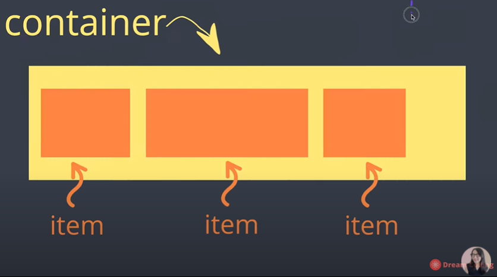

# CSS

## 1. 의미, 정의

> CSS : Cascading (폭포) Style Sheet, 연속해서 떨어지는 느낌

세부적인 정의가 있다면 쓰고, 없다면 넘어간다.

### Style

1. Author Style
2. User Style
3. Browser

Author Style이 최우선, User이 그 다음, Browser가 최남단. 이게 바로 Cascading!!

### ! important

저런 순서를 무시하고 important를 쓰기는 하는데, 이거는 최대한 피하는 쪽이 좋다.

## 2. 선택자

> selector : 어떤 tag들을 고를지 정해주는 기능

- * : Universal : 모든 태그들을 바꾼다.
- tag : type : 
- #id : ID
- class : Class
- : : state
- [] : Attribute

1. universal을 해주어도 태그로 스타일링 한 것이 먼저다.
2. div에 아무것도 안넣어주면 스타일링 해도 안보인다.
3. button:hover 은 button 위에 마우스를 올렸을 때의 스타일링이다.


## 3. 스타일링

### margin, padding

- margin : content 밖에 테두리
- padding : content 안에 테두리
  - 시계방향으로 사이즈 조절이 가능하다.
  - 양옆, 위아래는 20,0px 이렇게 지정하자.
- border : 테두리를 말한다.

### height

```css

  body, html {
      height: 100%;
  }
  .container {
      background: beige;
      height: 100vh;
  }
```
- 100% : container가 들어있는 부모의 높이에 100%를 채우겠다. 하지만 안되는데, 이는 body의 부모인 html의 높이가 100이 아니기 때문이다.
- 100vh (view for height) : 위와 같은 작업을 하지 않고, 나는 부모 상관없이 height를 100% 다 쓰겠다 하면 vh를 적용.


## 4. display, position

### display

- inline : content 자체만을 꾸며줌. 사전에 style은 개무시하고, content의 크기만큼 채운다.
- inline-block : content의 크기 상관없이 style에 맞춰서 생기지만, 한 줄에 block이 여러개 올 수 있다.
- block : block인데 한 줄에 하나씩이다.

### position

- left, right, top, right : 위치를 옮길 수 있다.
- static : 기본적인 태그들은 모두 static으로 이루어져있다.
- relative : 자기 자신이 원래 있어야 하는 위치에서 상대적으로 얼마나 떨어져있는지 관찰하는 것을 말한다.
- absolute : 자신이 담겨있는 박스의 포지션을 기준으로 움직인다.
- fixed : 상자에서 벗어나서 웹페이지 안에서 움직인다. 
- sticky : 스크롤링을 해도, 원래 그 자리에 그대로 있는 것을 의미한다.


## 5. Flex Box

box와 item을 행 열로 배치시켜주는 툴들이다.

box가 커지거나 작아지면 유연하게 어떻게 바뀔 수 있는지를 정할 수 있다.

## 예전에는 어떻게?

1. position
2. float
3. table

이거로는 복잡하고 시간이 많이 소요된다.

또한 이러한 작업을 하기 힘들다.

1. Box안에 item들을 가운데로 정렬하기
2. item들의 size 상관없이 동일한 간격 동일한 사이즈로 배치하는 것
3. box를 동일한 높이로 두는 것

### float

> image와 text를 어떻게 배치할 것인지 정의하기 위한 툴이다.

 

- float : left
- float : center
- float : right

이러한 float를 Hack, 적당히 써서 Box를 배치시키는데 사용하였다. 하지만 이건 그렇게 좋은 방법은 아니다.

### Flexbox

 

container & item을 정하는 속성값이 존재


중심축 (main axis)과 반대축이 존재.

<hr>

### container

- display
  - flex : inline 처럼 붙어진다. 크기를 줄이면 안에 text 양이 유지될 정도로만 줄어든다.
- flex-direction
  - row : main axis가 가로
  - row-reverse : 순서가 거꾸로 붙는다.
    - reverse : 여부에 따라 위에서 올라오냐, 아래로 내려가냐
  - column : main axis가 세로
- flex-wrap
  - default : nowrap : wrapping을 안하겠다. line 안에 것들이 사이즈가 작아져도 가만히 있는다.
  - wrap : 한 line이 꽉차면 자동적으로 다른 line으로 넘어감.
- flex-flow : column, nowrap 처럼 direction & wrap을 한 번에 묶어서 가능
- justify-content :  main axis에서 item의 순서를 바꾸지 않고, 이들을 어떻게 배치할 것인지?
  - flex-start : box들을 왼쪽으로 몰아넣는다.
  - flex-end : box들을 오른쪽으로 몰아넣는다.
  - center : box들을 가운데로 몰아넣는다.
  - space-around : box around에 space, 양 끝의 box들은 space가 생성된 부분이 조금이라 조금밖에 없다.
  - space-evenly : around와는 달리 양끝의 box들과 사이의 box들의 gap이 일정.
  - space-between : 왼, 오른쪽만 양끝에 맞추고, 나머지를 알아서 space 조절.
- align-items : 반대축에서 box를 배치
  - center : 반대축 기준으로 center
  - baseline : box의 크기가 서로 달라 안에 text의 위치가 다를 때, 이를 서로 같은 line으로 맞춰주는 역할
- align-content : 반대축의 item을 정한다.
  - center : item들이 그들의 size를 유지한체 겹치지 않은 체로 중간으로 모인다.
  - space-between : 위 아래는 딱 붙어있고 중간에는 center를 가짐.

### item

- order
- flex-grow : container가 커졌을 때, 어떻게 행동하나?
  - 1 : window size가 늘어남에 따라 같이 커진다.
  - 2 : window size가 커질 때, 남들보다 2배 더 커진다.
- flex-shrink: container가 작아졌을 때, 어떻게 행동하나?
  - 2 : window size가 작아질 때, 남들보다 2배 더 작아진다.
- flex-basis : item들이 공간을 얼마나 차지해야하는지 % 사용, 좀 더 세부적으로 명시하도록 도와준다.
  - auto : grow나 shrink에 맞춰서 변형된다.
  - % : 다른 아이들의 비해서 % 로 변환된다.
- align-self : container를 벗어나서 self로 이 지점만 다른 곳에 배치하고 싶다.
  - center : 중앙으로

## Tip

1. CSS 라이브러리를 쓸 때는 항상 호완성을 체크하고 써야한다. [reference : can i use?](https://caniuse.com/)
2. [Selector](https://flukeout.github.io/) 
3. [Color Tool Reference : color tool](https://material.io/resources/color/#!/?view.left=0&view.right=0)
4. flexbox reference
   1. [MDN reference](https://developer.mozilla.org/en-US/docs/Web/CSS/CSS_Flexible_Box_Layout/Basic_Concepts_of_Flexbox)
   2. [CSS-TRICKS](https://css-tricks.com/snippets/css/a-guide-to-flexbox/)
5. [flexbox game](https://flexboxfroggy.com/#ko)