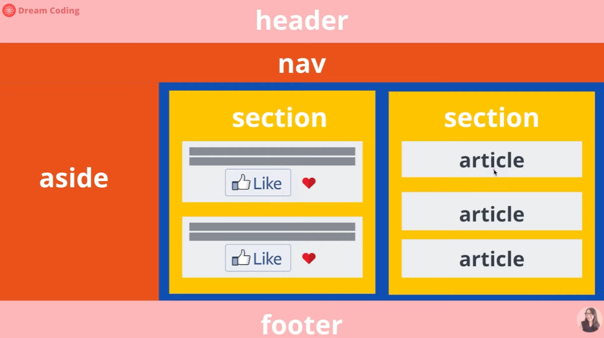
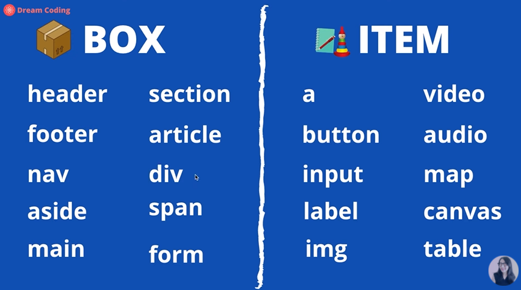
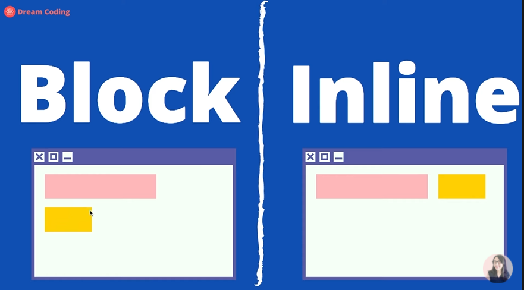
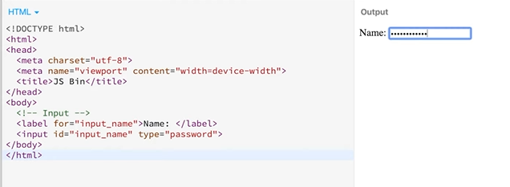

# HTML

## HTML



- header : logo나 Web Page의 대표적인 말
- nav : navigator의 준말, menu bar
- aside : category나 부수적인 content
- main : web page에서 보여지는 main content
  - section : 주제별로 묶어놓은 content
    - article : 같은 주제, 같은 형식의 content (재사용이 가능한 content)
  - div : 묶어서 스타일링이 필요할 때
    - button과 text를 묶어서 border나 background를 주고 싶을 때
- footer : web page의 정보나 contact us

[reference](https://developer.mozilla.org/en-US/docs/Learn/HTML/Introduction_to_HTML/Document_and_website_structure)

## box vs item



- box
- item

## block vs inline



- block : 내용이 없어도 형태는 존재
  - div (CSS로 변경 가능), 한 라인을 다 차지하게 된다.
- inline : 내용이 없으면 형태도 없음
  - span (CSS로 변경 가능)

## ol, ul, li

 - CSS 로 제거 가능하다.
 - ol과 ul은 container의 역할을 한다. 사용자의 눈에는 보이지 않는다.

## input, label



- input, label 둘 다 inline 요소를 가진다.
- input은 한 페이지 안에서 굉장히 많이 받을 수 있기 때문에 _**id 로 식별자를 **_준다.
  - text
  - button
  - checkbox
  - color
  - password
  - [reference](https://developer.mozilla.org/en-US/docs/Web/HTML/Element/input)
- label은 for 안에 _**input의 id 값을 넣어준다.**_
- 

## Tip

- box를 나눌 때, 너무 세세하게 나누면 성능이 저하된다.
- div에 어떤 값도 없으면 아무것도 안보인다.
```html

  div.container>div.item item${$}*10

  <div class="container">
    <div class="item item1">1</div>
    <div class="item item2">2</div>
    <div class="item item3">3</div>
    <div class="item item4">4</div>
    <div class="item item5">5</div>
    <div class="item item6">6</div>
    <div class="item item7">7</div>
    <div class="item item8">8</div>
    <div class="item item9">9</div>
    <div class="item item10">10</div>
  </div>
```